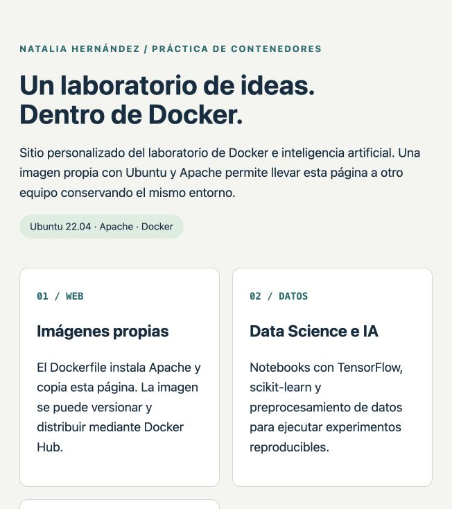
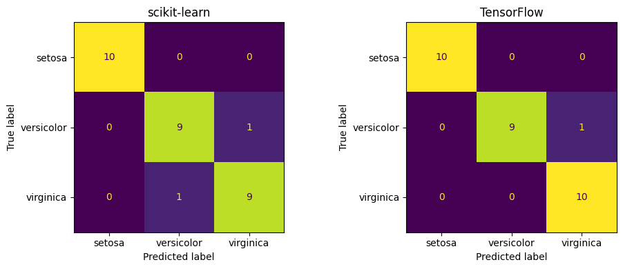

# Práctica de contenedores Docker e IA

**Natalia Hernández — 9 de septiembre de 2026**

Guía de referencia: *2025-03 Practica Docker_IA.docx*, profesor Oscar H. Mondragón.

## 1. Resultado y alcance

Se instalaron y probaron Docker CE en dos máquinas Ubuntu 22.04 administradas por Vagrant y VirtualBox. Se construyeron imágenes web propias, se ejecutaron ejemplos de copia de archivos y persistencia, se entrenaron modelos de IA dentro de Jupyter y se probó el desafío Docker + Flask.

**Publicación completada.** Las imágenes `nathernandez/ubuntuweb:v1` y `nathernandez/sitio-docker:v1` están disponibles públicamente en Docker Hub. Se verificaron sin autenticación y ambas se descargaron desde clienteUbuntu. El contenedor `webcliente` usa actualmente `nathernandez/sitio-docker:v1` y muestra el sitio personalizado en el puerto 9900. El proyecto se conserva en el repositorio privado [nathernandez1189/practica-docker-ia](https://github.com/nathernandez1189/practica-docker-ia), con commits organizados por configuración, web y volúmenes, IA y Flask, y documentación y evidencias.

La ejecución de IA usa una adaptación para ARM64. El repositorio original utiliza una rueda TensorFlow para Intel y Python 3.7. Se conservan tanto el original como la adaptación y se explica cada cambio en `ADAPTACIONES.md`.

## 2. Entorno y configuración de Vagrant

| Componente | Configuración comprobada |
| --- | --- |
| Anfitrión | macOS, Apple Silicon, ARM64, 16 GB RAM |
| Vagrant | 2.4.9 |
| VirtualBox | 7.2.16 |
| Box | bento/ubuntu-22.04, ARM64 |
| Sistema invitado | Ubuntu 22.04.5 LTS |
| Cliente | clienteUbuntu — 192.168.100.2 |
| Servidor | servidorUbuntu — 192.168.100.3 |
| Docker Engine | 29.8.0 |

Se reutilizaron las dos máquinas existentes del entorno `/Users/nataliahernandez/prueba`. Se arrancaron con `--no-provision` para conservar el trabajo previo. El Vagrantfile incluido en este proyecto reproduce las definiciones de cliente, servidor, hostname e IP del documento.

Se verificó comunicación entre cliente y servidor. Evidencias: `01-entorno-cliente.log` y `01-entorno-servidor.log`.

## 3. Instalación de Docker y uso de una imagen existente

El script `scripts/instalar-docker-ubuntu.sh` comprueba los paquetes incompatibles, instala certificados y curl, incorpora la clave GPG y el repositorio oficial de Docker para Ubuntu Jammy, e instala Docker CE, containerd, Buildx y Compose. Agrega `vagrant` al grupo docker y activa el servicio.

En ambas máquinas, `hello-world` terminó correctamente y el servicio Docker quedó activo. Los registros completos se conservan en `02-instalacion-servidor.log` y `02-instalacion-cliente.log`.

En la parte 3 se buscó Apache, se descargó `httpd:2.4` y se creó `web1` con el puerto 8800 del servidor dirigido al 80 del contenedor. Una solicitud HTTP devolvió la página de Apache. Después se detuvo y eliminó ese contenedor como solicita la guía; el puerto 8800 no se deja activo.

```bash
docker search apache --limit 5
docker pull httpd:2.4
docker run -d --name web1 -p 192.168.100.3:8800:80 httpd:2.4
curl http://192.168.100.3:8800
docker stop web1
docker rm web1
```

## 4. Imágenes propias y sitio personalizado

El Dockerfile de `test_docker` usa Ubuntu 22.04, instala Apache y apache2-utils, y copia `html1` a `/var/www/html`. Apache se ejecuta en primer plano para mantener vivo el contenedor.

La imagen `practica/ubuntuweb:base`, también etiquetada `practica/ubuntuweb:v1`, sirve exactamente el encabezado «Bienvenidos al servidor de prueba» en `http://192.168.100.3:9000` mediante el contenedor `webprueba`.

El ejercicio de personalización se implementa en `sitio-personalizado`: una página de Natalia Hernández sobre Docker, datos e IA. La imagen `practica/sitio-docker:v1` se ejecuta como `webpersonal` en `http://192.168.100.3:9001`. Se comprobó en el navegador del Mac y se guardó una captura real.



## 5. Docker Hub y prueba en cliente

Se publicaron dos imágenes públicas, construidas para Linux ARM64:

- [nathernandez/ubuntuweb:v1](https://hub.docker.com/r/nathernandez/ubuntuweb): Apache y la página de prueba de la parte 4.
- [nathernandez/sitio-docker:v1](https://hub.docker.com/r/nathernandez/sitio-docker): sitio personalizado del ejercicio 1.

Ambos envíos terminaron correctamente. Se verificaron las etiquetas v1 y la visibilidad pública mediante la API de Docker Hub sin autenticación. Los identificadores completos se conservan en `evidencias/dockerhub-publicacion.json` y la salida del envío en `05-publicacion-dockerhub.log`.

En clienteUbuntu se descargó la imagen del registro, se sustituyó el contenedor de la prueba local anterior y se creó el nuevo servicio:

```bash
docker pull nathernandez/ubuntuweb:v1
docker stop webcliente
docker rm webcliente
docker run -d --name webcliente -p 192.168.100.2:9900:80 nathernandez/ubuntuweb:v1
curl http://192.168.100.2:9900
```

El cliente devolvió «Bienvenidos al servidor de prueba». La imagen descargada tiene el mismo digest publicado: `sha256:84d2c76ca8e902c6a99803ae0426b2a572c250b6d8374ad6f107273599fd9177`. Después se descargó `nathernandez/sitio-docker:v1` y se recreó `webcliente` para dejar visible el sitio personalizado en la misma dirección. Su digest publicado es `sha256:3b9de05d882a240b123220873e907bca2cba592592e1e1591f8fe80049e8a383`. Los registros completos están en `05-descarga-dockerhub-cliente.log` y `05-sitio-docker-en-cliente.log`.


Se conserva `scripts/publicar-dockerhub.sh` para repetir la publicación de manera interactiva. Las credenciales no forman parte de los archivos de entrega.

## 6. Copia de archivos y volúmenes

La parte 6 construye `practica/testdir:v1` desde `test_docker2`. La guía crea `voldocker`, pero menciona `COPY html1`; se corrigió esa inconsistencia a `COPY voldocker/ /var/www/html/`. La página inicial y su enlace a `pagina1.html` respondieron correctamente en el puerto 9910. Se verificaron además los registros de Apache y la entrada al contenedor con `docker exec`.

`COPY` incorpora archivos a una capa de la imagen durante su construcción. Modificar el archivo fuente después no cambia por sí solo un contenedor creado a partir de esa imagen.

Un **bind mount** conecta una ruta concreta del anfitrión con una ruta del contenedor. En el ejemplo, `/home/vagrant/practica-docker-ia/volumenes` se monta en `/var/www/html` del contenedor `webvolumen`, que sirve el puerto 9920. Aquí el anfitrión de Docker es Ubuntu; el Mac es el anfitrión de VirtualBox.

Se realizaron tres comprobaciones:

- Se creó `cambio.txt` desde Ubuntu y se obtuvo inmediatamente por HTTP desde Apache.
- Otro contenedor escribió `desde-contenedor.txt` en el directorio montado; el archivo apareció en Ubuntu y se pudo leer por HTTP.
- Un contenedor temporal escribió en el volumen con nombre `practica_ia_datos`, fue eliminado y otro contenedor recuperó el texto «Los datos sobreviven al contenedor».

Un **volumen con nombre** es administrado por Docker y tiene un ciclo de vida independiente del contenedor. Resulta apropiado para datos persistentes; para editar archivos desde una carpeta concreta del anfitrión, el bind mount ofrece acceso directo. Evidencia: `ejercicio-volumenes.log`. Fuentes: [volúmenes](https://docs.docker.com/engine/storage/volumes/) y [bind mounts](https://docs.docker.com/engine/storage/bind-mounts/).

## 7. Contenedor de Data Science e IA

El contenedor `jupyter-ia` usa Python 3.11, TensorFlow 2.20.0, scikit-learn 1.7.2, NumPy, pandas y Matplotlib. Jupyter sirve el puerto 8888 con autenticación por token. El notebook, las métricas y el modelo se guardan en un directorio compartido del servidor.

El notebook `01-iris-docker-ia.ipynb` carga las 150 muestras Iris incluidas en scikit-learn, separa 120 de entrenamiento y 30 de prueba con estratificación y semilla 42. El preprocesamiento utiliza StandardScaler aprendido solamente sobre entrenamiento. Se comparan una regresión logística y una red neuronal de 4 entradas, 16 neuronas ocultas y 3 salidas.

| Modelo | Exactitud sobre 30 muestras de prueba |
| --- | --- |
| Regresión logística / scikit-learn | 93,33 % — 28 de 30 |
| Red neuronal / TensorFlow | 96,67 % — 29 de 30 |

El entrenamiento se realizó en CPU. Se guardaron `resultados/metricas.json` y `resultados/iris.keras`. La copia ejecutada del notebook contiene el código, salidas y matrices de confusión. Estas cifras demuestran el funcionamiento del entorno sobre este conjunto de prueba pequeño; no son una estimación de rendimiento universal.



## 8. Repositorio de TensorFlow y scikit-learn

Se clonó `https://github.com/asashiho/ml-jupyter-python3`. La copia sin modificaciones está en `referencias/ml-jupyter-python3`; su commit se registra en `evidencias/repositorios.json`.

El Dockerfile original selecciona Python 3.7 y una rueda TensorFlow 1.13.1 para `linux_x86_64`. No corresponde a la arquitectura ARM64 de la máquina. Se conserva una variante histórica con las correcciones indicadas por el profesor y una versión ejecutable con Python 3.11 y TensorFlow 2.20.0. La versión histórica no se marca como ejecutada.

La imagen adaptada `practica/ml-jupyter:arm64` se ejecuta como `ml-jupyter` en el puerto 8890. Sus tres notebooks se ejecutaron sin errores:

| Notebook | Experimento y resultado |
| --- | --- |
| 1.scikit-learnSample | Regresión lineal y predicción con validación cruzada de 10 particiones sobre diabetes; gráfica generada |
| 2.TensorFlowSample | Keras sobre MNIST: 2.000 imágenes de entrenamiento, 500 de prueba, tres épocas; exactitud 89,60 % |
| 3.ScipySample | Integración numérica del sistema de Lorenz y trayectoria tridimensional generada |

Los cambios incluyen sustituir el conjunto retirado `load_boston`, actualizar la extensión TensorBoard y la creación de ejes 3D, y limitar el entrenamiento a los recursos disponibles. Se mantiene el propósito de los ejemplos. La lista completa de ajustes se encuentra en `ADAPTACIONES.md`.

## 9. Desafío Docker + Flask

Se clonó `https://github.com/omondragon/docker-flask-example`. La imagen `practica/flask:v1` usa su código original `app.py` y `data.py`, con Python 3.11 y Flask 3.1.2. El contenedor `flask-practica` expone el puerto 5000 y devuelve JSON con la colección `my_articles`.

La prueba HTTP obtuvo estado 200 y una colección no vacía. Se conserva el modo de desarrollo indicado por el profesor. No se ejecutaron los desafíos opcionales de CUDA ni Docker dentro de LXD.

## 10. Validación y archivos de entrega

La validación automática desde el Mac comprobó diez accesos HTTP, incluyendo ambas direcciones del intercambio de archivos y las páginas Jupyter. También revisó los cuatro notebooks ejecutados: todas sus celdas con código tienen contador de ejecución y no contienen salidas de error. **14 comprobaciones aprobadas.**

Además, el registro independiente del cliente verifica la descarga desde Docker Hub, su digest y el servicio del contenedor recreado. Los servicios se volvieron a iniciar después de un apagado ordenado del servidor para comprobar que el laboratorio se puede retomar.

Las evidencias principales son los registros de instalación, construcción y ejecución; `verificacion.json`; `requirements-ejecutados.txt`; `imagenes-finales.txt`; `contenedores-finales.txt`; los notebooks con sus salidas; la captura del sitio y las figuras extraídas de los notebooks.

El repositorio [nathernandez1189/practica-docker-ia](https://github.com/nathernandez1189/practica-docker-ia) incluye el código, las fuentes de referencia, los notebooks ejecutados y los informes Word/PDF. Su [historial de commits](https://github.com/nathernandez1189/practica-docker-ia/commits/main/) organiza la entrega en cuatro cambios temáticos. Se creó como privado; el acceso de otras personas se concede por separado. Para abrir, retomar y apagar el laboratorio se incluyen instrucciones en `README.md`. El paquete de entrega excluye claves, tokens, conexiones SSH, cachés y entornos auxiliares.

## Referencias

- Mondragón, Oscar H. *Práctica Contenedores Docker*. Documento suministrado por la estudiante.
- [Docker: instalación en Ubuntu](https://docs.docker.com/engine/install/ubuntu/).
- [Docker: volúmenes](https://docs.docker.com/engine/storage/volumes/).
- [Docker: bind mounts](https://docs.docker.com/engine/storage/bind-mounts/).
- [TensorFlow: instalación con pip](https://www.tensorflow.org/install/pip).
- [Repositorio ml-jupyter-python3](https://github.com/asashiho/ml-jupyter-python3).
- [Repositorio docker-flask-example](https://github.com/omondragon/docker-flask-example).
